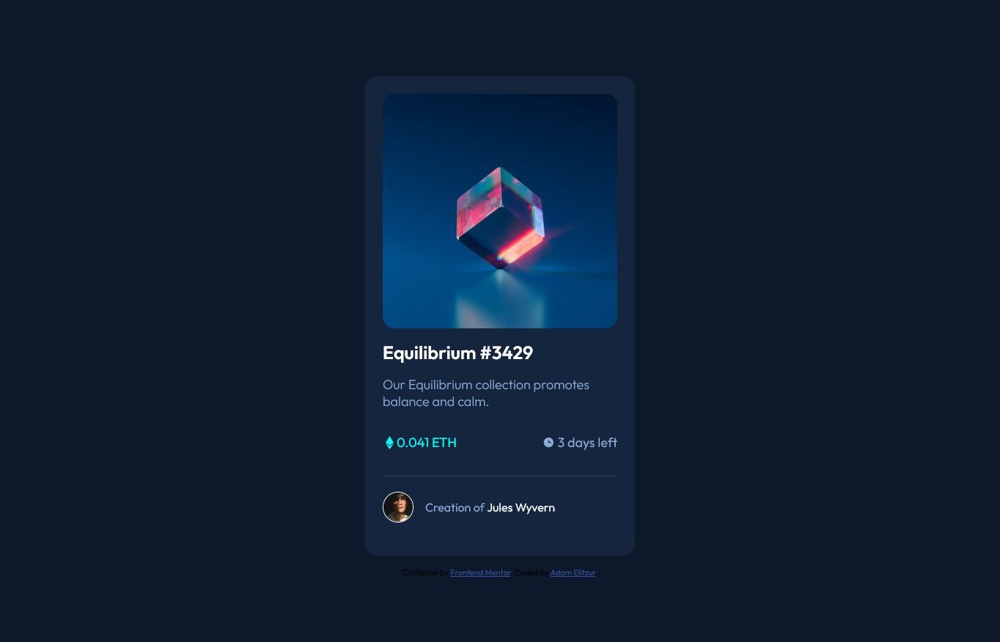

# Frontend Mentor - NFT preview card component

This is a solution to the [NFT preview card component](https://www.frontendmentor.io/challenges/nft-preview-card-component-SbdUL_w0U/hub/nft-card-with-css-flexbox-NM5LJruHG). Frontend Mentor challenges help you improve your coding skills by building realistic projects.

## Table of contents

-   [Overview](#overview)
    -   [Screenshot](#screenshot)
    -   [Links](#links)
-   [My process](#my-process)
    -   [Built with](#built-with)
    -   [What I learned](#what-i-learned)
-   [Author](#author)

## Overview

### Screenshot

### Links

-   Solution URL: [Github](https://github.com/AdamElitzur/FM-NFT-preview-card-component-challenge)
-   Live Site URL: [NFT Preview Card](https://fm-nft-preview-card-component-challenge.vercel.app/)

## My process

### Built with

-   Semantic HTML5 markup
-   CSS custom properties
-   Flexbox
-   Mobile-first workflow

### What I learned

I got better at making a basic card and adding active states, including a hover animation and tint over the main image.

## Author

-   Frontend Mentor - [@AdamElitzur](https://www.frontendmentor.io/profile/adamelitzur)
-   Twitter - [@adamcandoit](https://twitter.com/adamcandoit)
